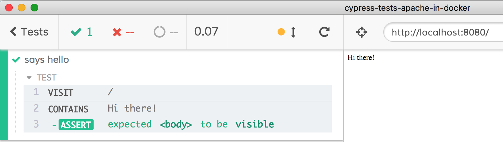

# cypress-tests-apache-in-docker
> Example running Cypress against Apache server running in a Docker container

## Install

Install NPM dependencies (mostly Cypress really)

```shell
npm install
```

## Build an image

If you have Docker running, build a Docker image with Apache webserver and a single static page.

```shell
npm run build
```

See [package.json](package.json) for the example Docker command that runs. Should build image `website`.

## Run image

Once the image is built, start it with `npm start`. This should start Docker container `my-site` and expose the Apache server at `http://localhost:8080`. Set this url as `baseUrl` in the [cypress.json](cypress.json) file.

## Test it using Cypress

Start Cypress Test Runner

```shell
npm run cy:open
```

This should open a list of specs, select spec filename like [spec.js](cypress/integration/spec.js) and it should run a simple end-to-end test against the Apache server running in a Docker container.



## Shut down container

You can shutdown the container by name. To find it use

```shell
docker ps --filter=name=my-site
# take the ID then stop the container
docker stop <id>
```

## See also

- [Cypress and Docker documentation](https://on.cypress.io/docker)
- [cypress-example-docker-compose](https://github.com/cypress-io/cypress-example-docker-compose)
